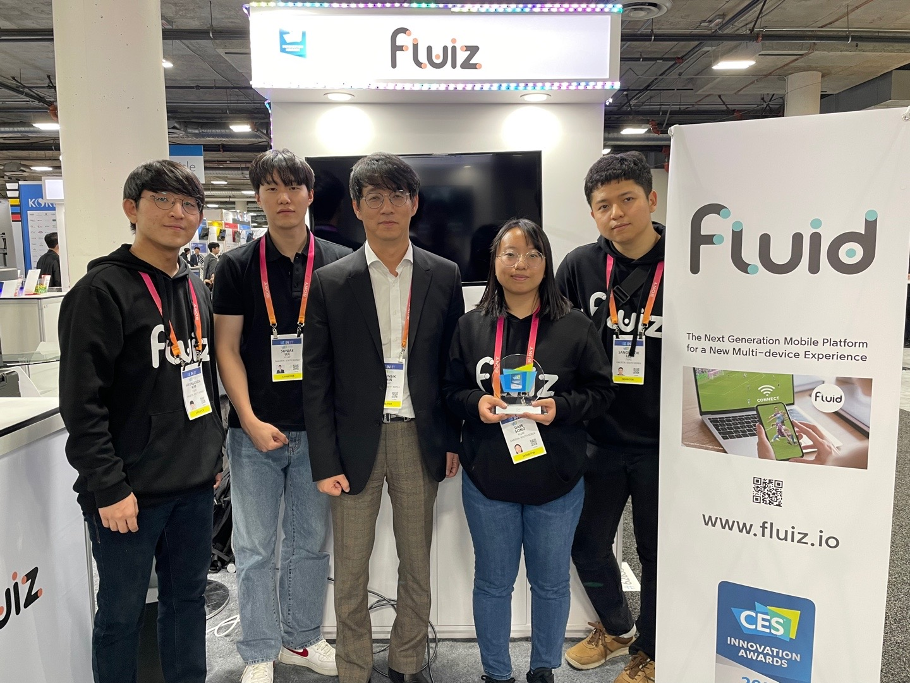

I helped to run the booth of [Fluiz](https://www.fluiz.io), a startup founded by my advisor, Insik Shin. I worked as a software engineer in the 2022 Fall and Winter. Our company won the CES 2023 Innovation Awards in the Software & Mobile Apps at CES 2023. We ran a booth at the KAIST section. I contributed to the process of winning the award and preparing the booth. Also, I explained our product, FLUID: Next-generation Multi-device Mobile Platform) to the people in the industry. It was a very valuable experience.
