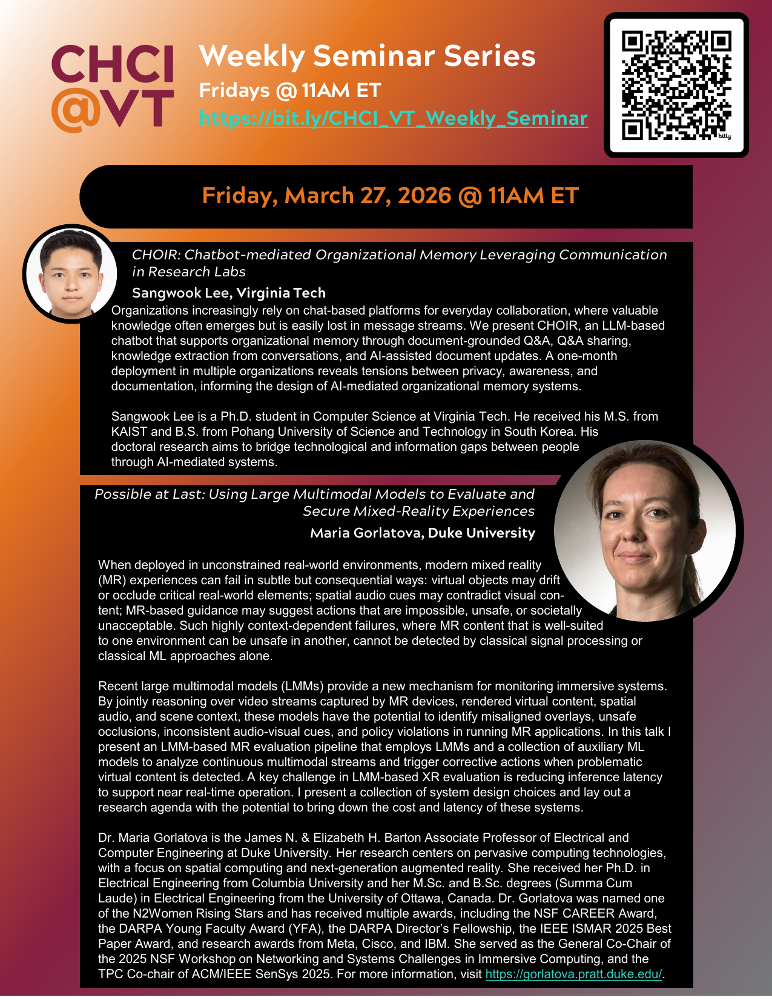

I gave the opener talk at the [CHCI@VT Weekly Seminar Series](https://hci.icat.vt.edu/events/weekly-seminar-series.html) on March 27, 2026, presenting "[CHOIR: Chatbot-mediated Organizational Memory Leveraging Communication in Research Labs](/publications/choir)" ahead of the main talk by [Prof. Maria Gorlatova](https://gorlatova.pratt.duke.edu/) from Duke University.

In the talk, I introduced CHOIR, an LLM-based Slack chatbot that supports organizational memory through document-grounded Q&A, Q&A sharing, knowledge extraction from conversations, and AI-assisted document updates, and shared what we learned from a one-month deployment in four research labs, including the tensions between privacy, awareness, and documentation.

Thanks to the Center for Human-Computer Interaction at Virginia Tech for the invitation, and to everyone who attended!
