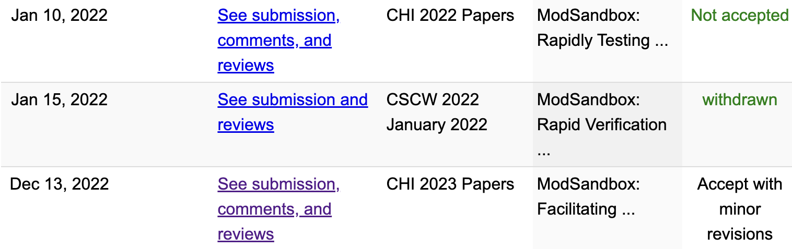

My first paper, "[ModSandbox](https://dl.acm.org/doi/10.1145/3544548.3581057): Facilitating Online Community Moderation Through Error Prediction and Improvement of Automated Rules," was accepted in CHI 2023! I collaborated with [Jean Y. Song](https://jyskwon.github.io/) in 2019 Fall to publish a study about the system for online community moderators to configure their rule-baed moderation tools. The paper was rejected in CHI 2022 and CSCW 2022 and finally accepted in CHI 2023. Thanks to our advisor, [Juho Kim](https://juhokim.com), and co-authors, [Jisoo](https://www.linkedin.com/in/jisoo-lee-a106951a8/) and [Mina](https://www.linkedin.com/in/min-a-kim/). Also, I would like to thank Prof. [Insik Shin](https://cps.kaist.ac.kr/~ishin/) for supporting me in continuing my research.
