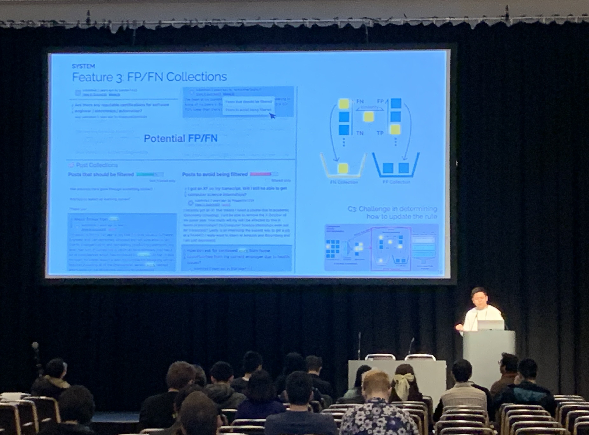
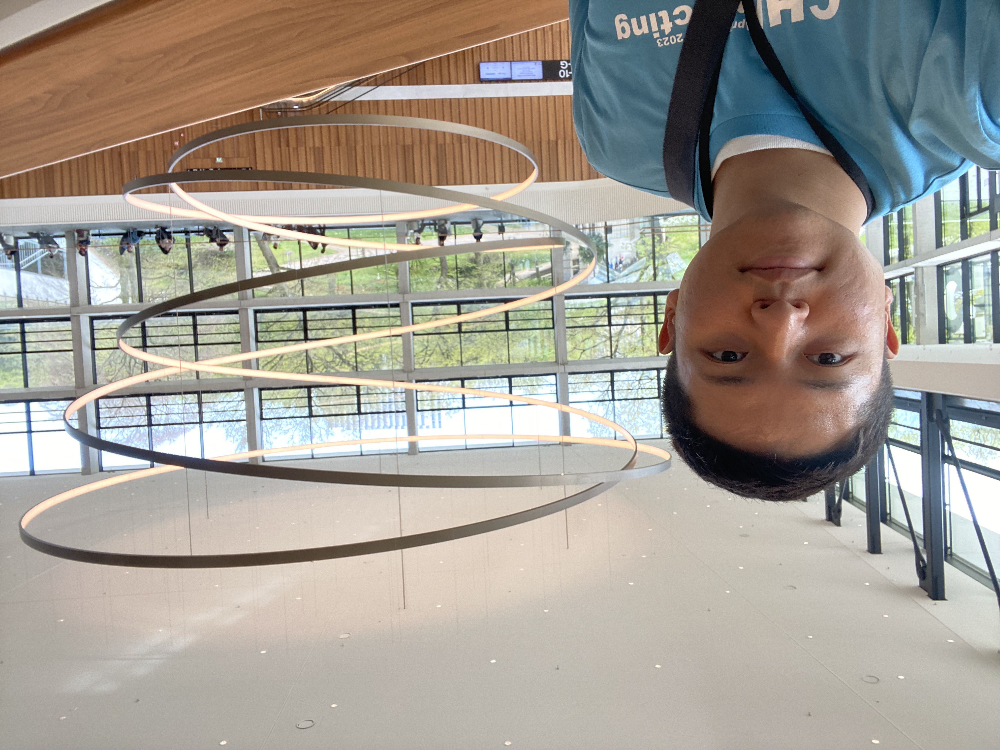

I visited Hamburg, Germany to attend CHI2023 and presented my paper "ModSandbox: Facilitating Online Community Moderation Through Error Prediction and Improvement of Automated Rules." It had been seven years since I first attended CHI in 2016. Although it was not a popular session, presenting my research in front of audience was a truly meaningful experience! I hope to have more opportunities to present at such conferences in the future.

Fortunately, I got an opportunity to participate in the conference as a student volunteer. I was able to meet a lot of graduate students in HCI fields. We shared our interesting research together.
