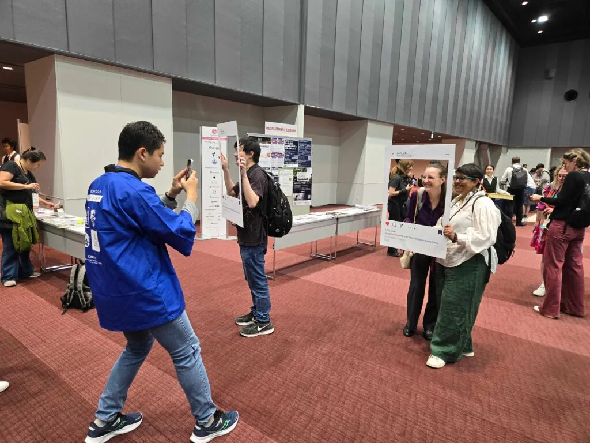

I traveled to Yokohama, Japan for CHI2025 as a Photography SV, continuing my role from CHI2024. This year, I also served as the leader of the Videography team, where I led the production of short-form interview videos featuring conference attendees.

Our team created engaging content that captured the diverse perspectives and experiences of CHI2025 participants. These videos were featured on the [ACM CHI Instagram account](https://www.instagram.com/acm_chi/), sharing the vibrant energy and community spirit of the conference with a broader audience.

Additionally, we organized an interactive photo event where attendees could take commemorative photos with an Instagram-style frame. This event became a popular spot for participants to capture their CHI2025 memories and connect with fellow researchers.

While I didn't have a publication to present this year, I'm looking forward to the possibility of returning to CHI as a presenter in the future with my own accepted work. Participating as a Student Volunteer continues to be an incredible opportunity to connect with researchers from around the world and contribute to the HCI community.

