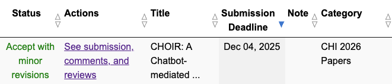
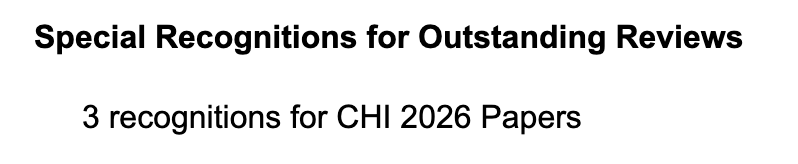

I'm excited to share two pieces of good news from CHI 2026!

First, my paper "[CHOIR: A Chatbot-mediated Organizational Memory Leveraging Communication in University Research Labs](/publications/choir)" was accepted with minor revisions at CHI 2026! CHOIR explores how everyday conversations can become organizational knowledge, where questions reveal gaps in documentation and answers become shared resources. We found that AI can facilitate rather than replace human communication, while also uncovering a tension between individual privacy and organizational awareness.

Second, I received Outstanding Reviewer Recognition for all three papers I reviewed as an external reviewer for CHI 2026! It was an honor to contribute to the review process and help maintain the quality of research in the HCI community.

I'm grateful to my advisor [Prof. Sang Won Lee](https://echolab.cs.vt.edu/sangwonlee/), my co-authors Adnan Abbas, Yan Chen, and Young-Ho Kim, and the [echolab](https://echolab.cs.vt.edu/) for their support throughout this research.
