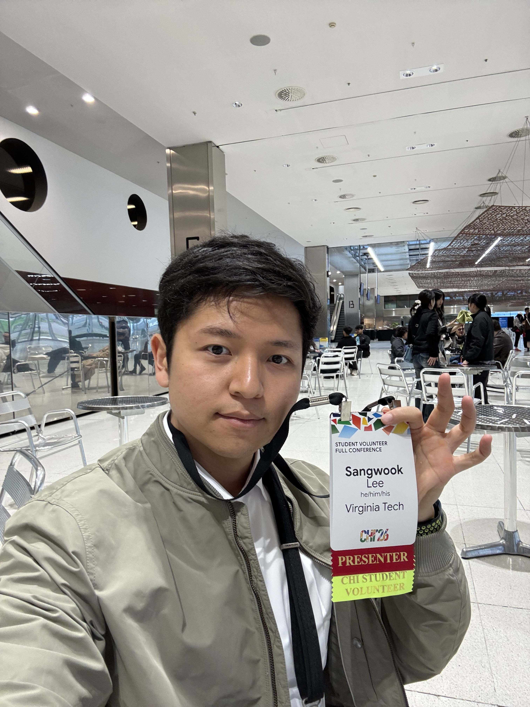
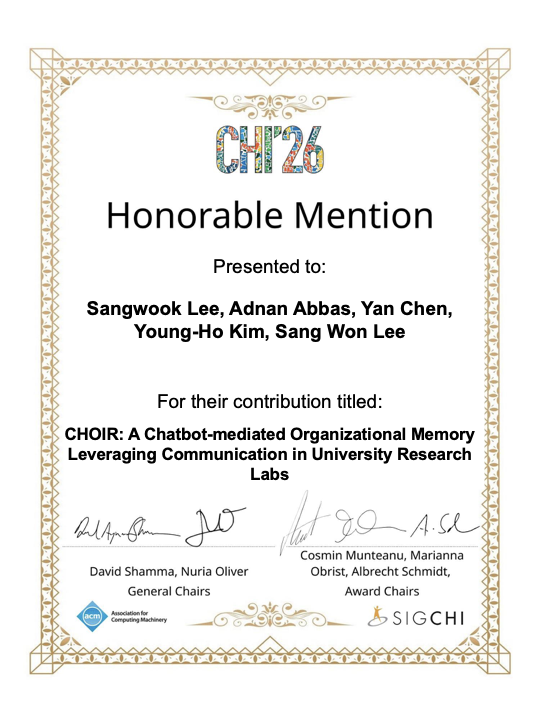

I traveled to Barcelona for CHI 2026 to present our paper "[CHOIR: A Chatbot-mediated Organizational Memory Leveraging Communication in University Research Labs](/publications/choir)." This was my first CHI presentation as the sole first author, and the first paper I led as a PhD student at Virginia Tech, working with my advisor [Prof. Sang Won Lee](https://echolab.cs.vt.edu/sangwonlee/) at [echolab](https://echolab.cs.vt.edu/). My previous CHI paper, [ModSandbox](/publications/modsandbox) at CHI 2023, was a co-first-authored work, so this trip to Barcelona felt like a new milestone. I also continued my role as a Student Volunteer alongside the presentation.

I'm also thrilled to share that CHOIR received a **Best Paper Honorable Mention** at CHI 2026, an award given to the top 5% of submissions. This is my first Honorable Mention since CHI 2016, where our team reached the final round of the Student Design Competition — ten years ago. Receiving this recognition for a full paper this time makes the moment especially meaningful to me.

A huge thanks to my co-authors Adnan Abbas, Yan Chen, Young-Ho Kim, and my advisor Sang Won Lee. I'm also grateful to everyone in echolab and to the CHI community for the thoughtful feedback and conversations in Barcelona.

<iframe
  width='480'
  height='270'
  src='https://www.youtube.com/embed/Eh2wlZkm-0Q'
  title='CHOIR presentation at CHI 2026'
  frameborder='0'
  allow='accelerometer; autoplay; clipboard-write; encrypted-media; gyroscope; picture-in-picture'
  allowfullscreen
></iframe>

