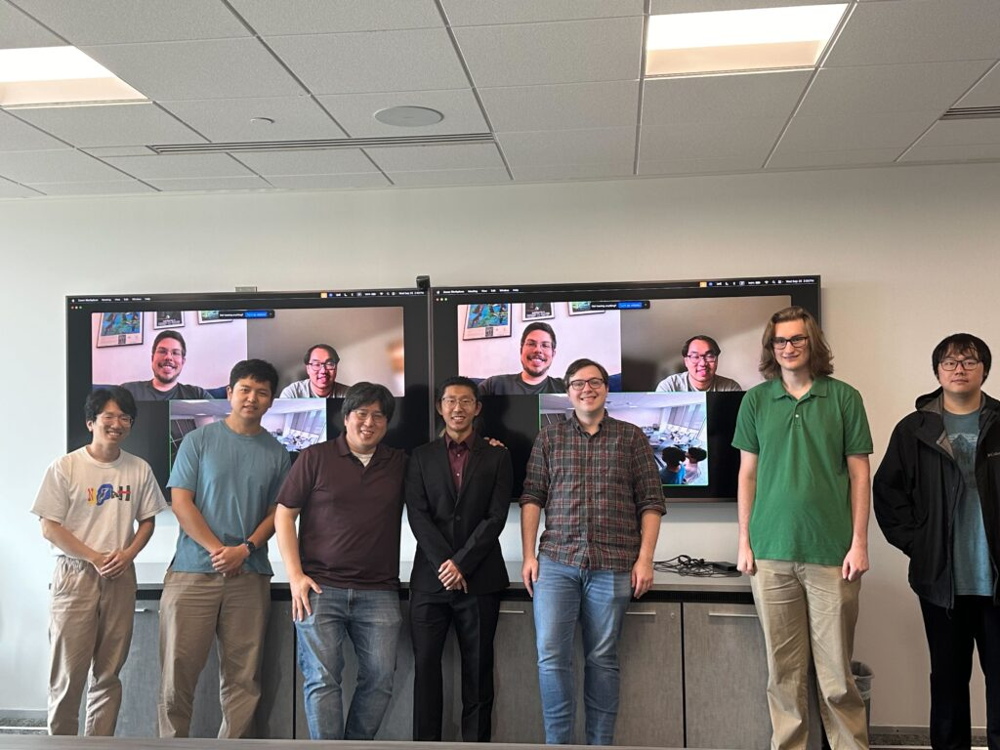

I'm excited to announce that I've joined the [Echolab](https://echolab.cs.vt.edu/) at Virginia Tech as a Ph.D. student, working with [Prof. Sang Won Lee](https://echolab.cs.vt.edu/sangwonlee/). 

Echolab's mission is to explore and develop methods to foster empathic interactions among individuals using computational systems. The lab focuses on three key research themes: computational tools for perspective sharing, computers as an expressive medium, and the facilitation of empathic communication. The lab also studies how to create safe environments where people can be vulnerable.

Echolab is a platform where members develop into independent researchers, a community where inclusion is prioritized, and a place where collaboration and learning from each other are valued.

I'm looking forward to contributing to the lab's research in human-computer interaction, particularly in accessibility, social computing, and human-AI interaction.

