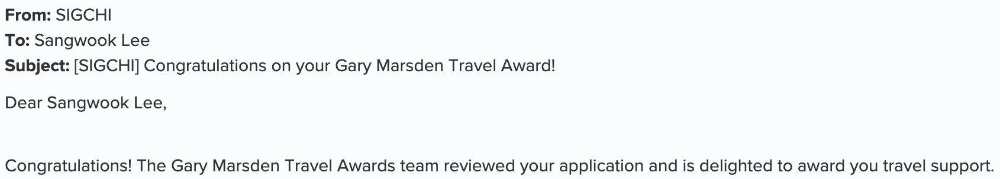

I'm selected as a Gary Marsden Travel Awardee, a travel support award of ACM SIGCHI.
Thanks to the committee who give me financial support to attend on-site UIST 2022!
I'll present a poster and meet a lot of people!

We designed and evaluated LV-Linker (Log and Video Linker), a web-based data viewer system for synchronizing both smartphone usage log and video data to help researchers quickly to analyze and easily understand user behaviors.

Thanks to my co-authors, Hansoo Lee, Youngji Koh, and Prof. Uichin Lee in KAIST!
