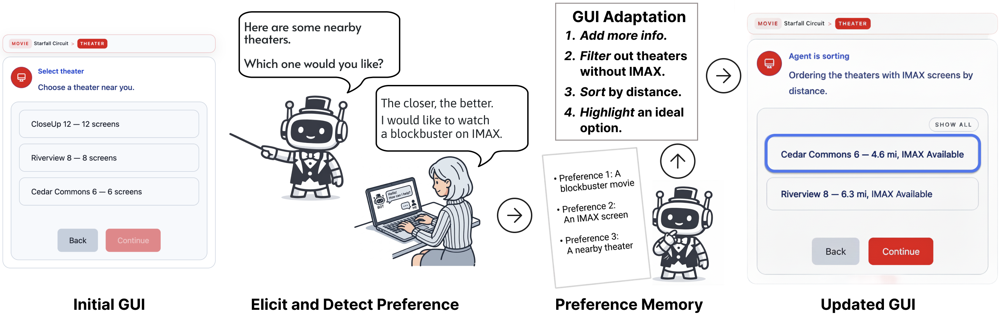

My paper "[MAESTRO: Adapting GUIs and Guiding Navigation with User Preferences in Conversational Agents with GUIs](/publications/maestro)" was accepted at UIST 2026! It will appear as both a paper and a demo at UIST '26 in Detroit this November.

MAESTRO extends a task-oriented chatbot's role from executing commands to supporting decisions. It keeps a shared preference memory built from what users say, adapts the existing GUI in place (augmenting, filtering, sorting, and highlighting options), and guides users back to an earlier step when their preferences conflict with the available options. In a within-subjects study with 33 participants on movie ticketing, MAESTRO led to fewer preference violations than a baseline agent. You can try it at the [MAESTRO demo](https://maestro.cs.vt.edu/).

This is my first UIST full paper, four years after presenting a poster ([LV-Linker](/publications/lv-linker)) at UIST 2022. I'm grateful to my co-authors Adnan Abbas, Young-Ho Kim, Yan Chen, and my advisor [Prof. Sang Won Lee](https://echolab.cs.vt.edu/sangwonlee/), and to the [echolab](https://echolab.cs.vt.edu/) for their support.
