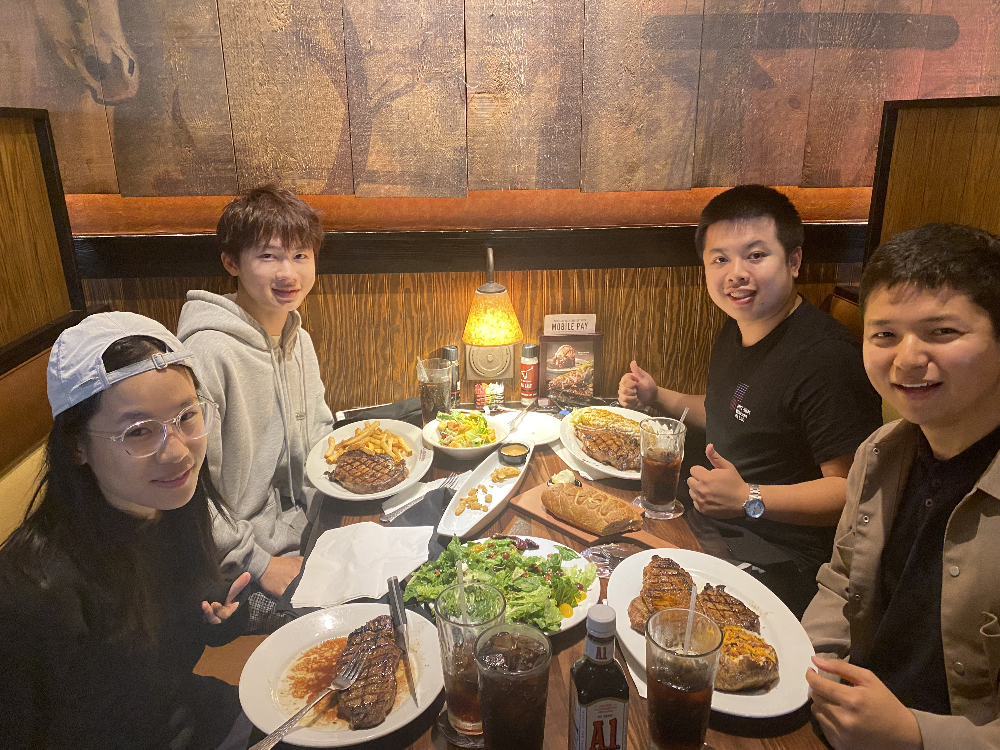
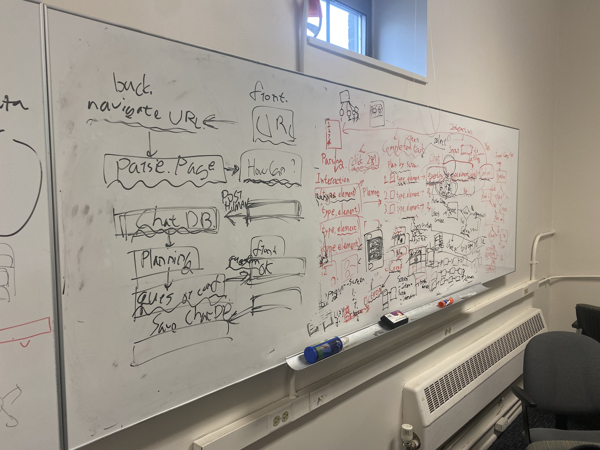

After meeting and talking with Toby Li at CHI2023, I got the opportunity to visit his lab at the University of Notre Dame this summer. He warmly welcomed me and even celebrated my birthday.

I engaged in enthusiastic discussions and collaborated with two Chinese undergraduate interns he introduced, working on implementing TOMAS (Task-Oriented Multimodal Agent System).

While it's not yet complete, I plan to conduct additional user studies back in Korea and write a paper on it.

<iframe
  height='315'
  src='https://www.youtube.com/embed/r-CzknbhwTw'
  title='TOMAS - Prototype video'
  frameborder='0'
  allow='accelerometer; autoplay; clipboard-write; encrypted-media; gyroscope; picture-in-picture'
  allowfullscreen
  className='w-full'
></iframe>
