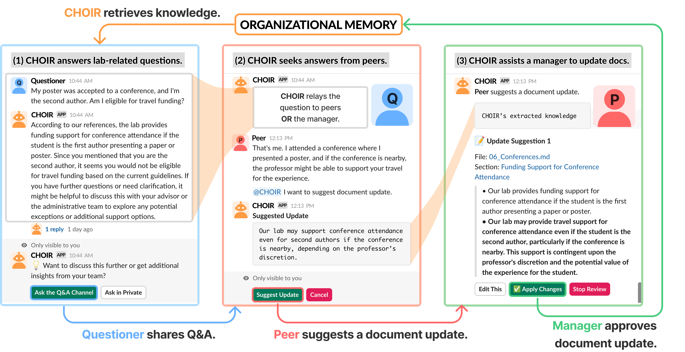
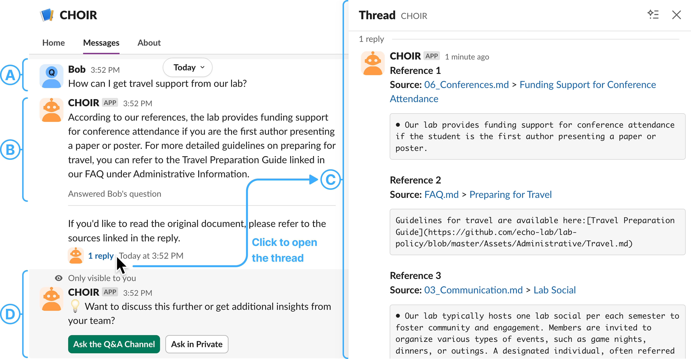
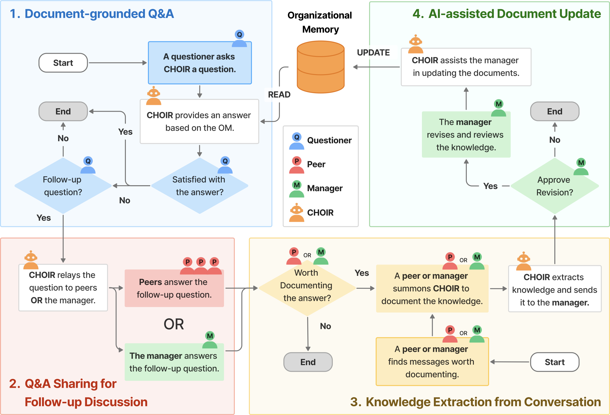

<iframe
  src='https://www.youtube.com/embed/I5gXbZQnmP0'
  title='CHOIR Demo Video'
  referrerPolicy='strict-origin-when-cross-origin'
  allow='accelerometer; autoplay; clipboard-write; encrypted-media; gyroscope; picture-in-picture; web-share'
  allowFullScreen
  style={{ aspectRatio: '16/9', width: '100%', border: 0 }}
></iframe>

## Abstract

University research labs often rely on chat-based platforms for communication and project management, where valuable knowledge surfaces but is easily lost in message streams. Documentation can preserve knowledge, but it requires ongoing maintenance and is challenging to navigate. Drawing on formative interviews that revealed organizational memory challenges in labs, we designed CHOIR, an LLM-based chatbot that supports organizational memory through four key functions: document-grounded Q&A, Q&A sharing for follow-up discussion, knowledge extraction from conversations, and AI-assisted document updates. We deployed CHOIR in four research labs for one month (n=21), where the lab members asked 107 questions and lab directors updated documents 38 times in the organizational memory. Our findings reveal a privacy-awareness tension: questions were asked privately, limiting directors' visibility into documentation gaps. Students often avoided contribution due to challenges in generalizing personal experiences into universal documentation. We contribute design implications for privacy-preserving awareness and supporting context-specific knowledge documentation.

## Background

Research labs depend on chat platforms like Slack for daily coordination, where members exchange tacit, hard-won knowledge (paper-submission tips, conference logistics, lab norms) that rarely makes it into documentation. Maintained handbooks could preserve this knowledge, but writing and updating them is a slow, costly task that often falls on a single manager. Through formative interviews, we identified four design goals for CHOIR: (DG1) streamline document updates, (DG2) enable easy and accurate retrieval, (DG3) facilitate communication among members, and (DG4) support members' participation in maintaining organizational memory.

## Key Features

CHOIR is a Slack-embedded chatbot built around four interlocking features that turn everyday lab conversation into living organizational memory:

1. **Document-grounded Q&A**: Members ask CHOIR via DM or by mentioning `@CHOIR` in a channel; CHOIR answers with citations to the lab repository and abstains when coverage is insufficient, surfacing documentation gaps instead of hallucinating.
2. **Q&A Sharing for Follow-up Discussion**: After receiving an answer, the questioner can post the exchange to a public Q&A channel or send it as a private DM to selected members, optionally anonymously, to invite further discussion.
3. **Knowledge Extraction from Conversations**: When a discussion produces something worth documenting, any member can summon CHOIR to extract a documentable summary from the thread and forward it to the manager as a suggested update.
4. **AI-assisted Document Update**: The manager reviews each suggestion in Slack, picks a target file (or creates a new one), and steps through diff-style proposals (edit, apply, skip, or stop) that are committed back to the GitHub-backed repository.

## System Workflow

The four features compose a feedback loop that connects three roles (*questioner*, *peer*, and *manager*) to a shared organizational memory repository. A question reads from the documentation; a discussion can extract knowledge; and approved updates write back to the repository, which in turn grounds future answers.

CHOIR is implemented with the Slack Bolt framework, with documentation stored in a GitHub repository as Markdown. Q&A uses retrieval-augmented generation over an embedding index of the repository (GPT-4o for generation, text-embedding-3-small for retrieval), and user names are pseudonymized before any message is sent to the LLM.

## Field Study

We deployed CHOIR in four university research labs for one month (n=21). During the deployment, members asked **107 questions** and lab directors made **38 document updates** through CHOIR.

Three findings stood out:

- **CHOIR took on social roles in the lab.** Participants framed CHOIR as "a senior in the lab" or "a librarian," using it as a low-friction first stop before pinging a person. All four labs chose to keep CHOIR running after the study.
- **A privacy–awareness tension shaped what directors could see.** Three of the four labs preferred private DMs for questions, leaving directors largely unaware of which gaps existed in their handbooks. The one lab with a public-Q&A culture surfaced gaps naturally and produced the most direct documentation updates.
- **Students hesitated to contribute, even when they knew the answer.** Personal experience often felt too situated to generalize into universal documentation, pointing to a need for tools that help contributors lift context-specific knowledge into shareable form without losing nuance.

These findings inform design implications for **privacy-preserving awareness** (letting directors see *what* is being asked without exposing *who* is asking), and for **context-specific knowledge documentation** that helps members translate personal experience into organizational memory.
