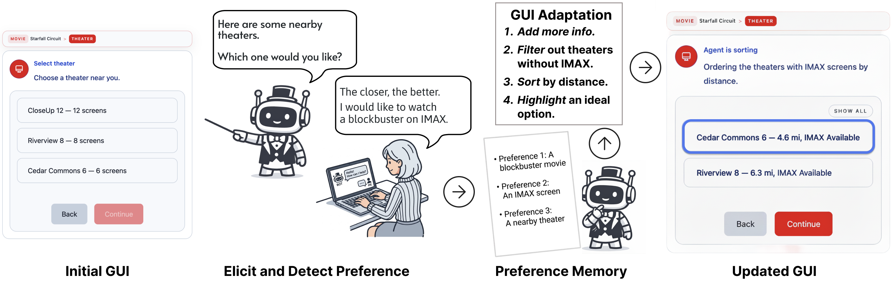
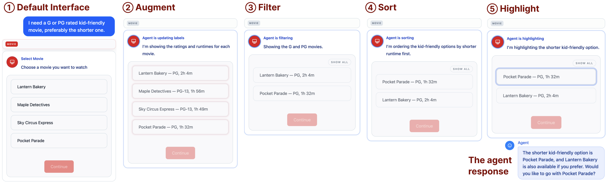
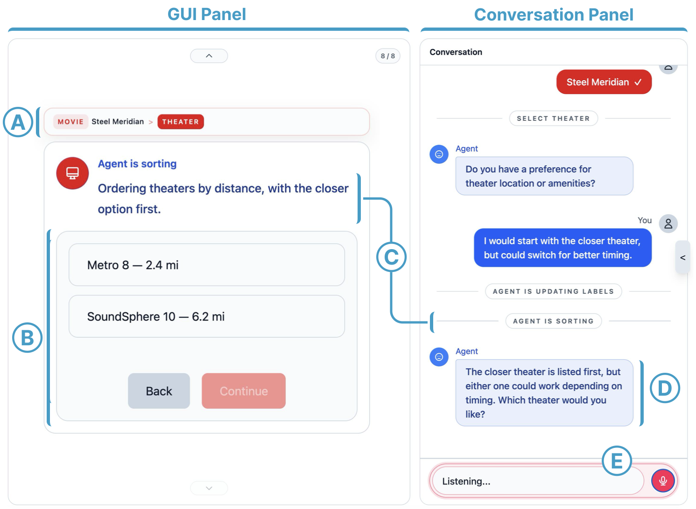
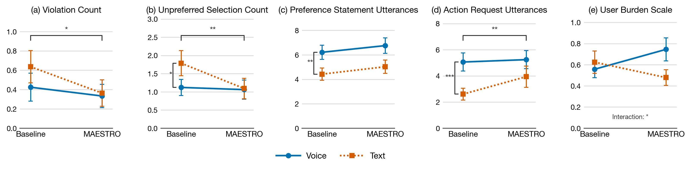

<iframe
  src="https://www.youtube.com/embed/jEbXFvnYTOg"
  title="MAESTRO Demo Video"
  referrerPolicy="strict-origin-when-cross-origin"
  allow="accelerometer; autoplay; clipboard-write; encrypted-media; gyroscope; picture-in-picture; web-share"
  allowFullScreen
  style={{ aspectRatio: "16/9", width: "100%", border: 0 }}
></iframe>

## Abstract

Modern task-oriented chatbots present GUI elements alongside natural-language dialogue, yet the agent's role has largely been limited to interpreting natural-language input as GUI actions and following a linear workflow. In preference-driven, multi-step tasks such as booking a flight or reserving a restaurant, earlier choices constrain later options and may force users to restart from scratch. User preferences serve as the key criteria for these decisions, yet existing agents do not systematically leverage them. We present MAESTRO, which extends the agent's role from execution to decision support. MAESTRO maintains a shared preference memory that extracts preferences from natural-language utterances with their strength, and provides two mechanisms. *Preference-Grounded GUI Adaptation* applies in-place operators (augment, sort, filter, and highlight) to the existing GUI according to preference strength, supporting within-stage comparison. *Preference-Guided Workflow Navigation* detects conflicts between preferences and available options, proposes backtracking, and records failed paths to avoid revisiting dead ends. We evaluated MAESTRO in a movie-booking Conversational Agent with GUI (CAG) through a 2 (Condition: Baseline vs. MAESTRO) × 2 (Mode: Text vs. Voice) within-subjects study (N=33).

## Key Mechanisms

MAESTRO extends a Conversational Agent with GUI (CAG) by introducing a *shared preference memory* and two grounded mechanisms:

1. **Preference-Grounded GUI Adaptation**: Four in-place operators (*augment*, *filter*, *sort*, and *highlight*) manipulate the information representation within the existing GUI without altering its structure, so users can compare and confirm options directly within the visual context.
2. **Preference-Guided Workflow Navigation**: The agent detects conflicts between user preferences and available options, proposes a specific step to return to, and records failed paths to avoid revisiting dead ends.

## System Interface

MAESTRO's split-panel interface pairs adaptation actions with conversation: a workflow breadcrumb tracks progress, the GUI panel reflects in-place adaptations, and the chat panel surfaces the agent's adaptation actions and follow-up prompts.

## User Study

We evaluated MAESTRO through a 2×2 within-subjects study (N=33) using a movie-ticketing CAG, crossing Condition (Baseline vs. MAESTRO) with Mode (Text vs. Voice). Each participant completed a warm-up task and a main task that required revisiting earlier steps due to preference conflicts. We analyzed the resulting 128 trials with mixed-effects models, with results shown below.

### RQ1: How MAESTRO Supported Decision Making

**MAESTRO improved decision quality.** While task success rates did not differ significantly, two reverse proxies for decision quality dropped under MAESTRO:

- **Violation Count** (panel a): MAESTRO significantly reduced violations of hard preferences (β=−0.80, *p*=.047), meaning the final tickets matched what users had asked for more often.
- **Unpreferred Selection Count** (panel b): MAESTRO produced fewer unpreferred picks during the booking process (β=−0.56, *p*=.008). Voice further reduced unpreferred selections compared to Text (β=−0.45, *p*=.029).

Task completion time was directionally longer under MAESTRO due to GUI-adaptation overhead, but the difference was not significant.

**MAESTRO and Voice shaped how users talked to the agent.** Looking at utterance categories:

- **Preference Statements** (panel c) were significantly more frequent in Voice than Text (β=0.34, *p*=.002), regardless of condition.
- **Action Requests** (panel d) increased under MAESTRO (β=0.39, *p*=.006) and under Voice (β=0.68, *p* &lt; .001).

Together, these patterns suggest that MAESTRO and Voice encouraged more active, expressive interaction without inflating overall verbosity (information-seeking and total utterance counts did not change significantly).

### RQ2: How Users Perceived MAESTRO

**Participants clearly preferred MAESTRO over Baseline.** A post-study ranking across all four conditions yielded a significant Friedman test (χ²(3)=22.45, *p* &lt; .001). Pairwise Wilcoxon tests confirmed MAESTRO was preferred over Baseline in both Text (Δ=−1.03, *p* &lt; .001) and Voice (Δ=−0.48, *p*=.028). Mean ranks placed MAESTRO Text first (1.64), then MAESTRO Voice (2.61), Baseline Text (2.67), and Baseline Voice (3.09). When asked for a single top choice, 19 of 32 participants picked MAESTRO Text. In open-ended responses, participants praised the side-by-side layout, the system's ability to retain preferences across backtracking, and the perceived sense of control from direct GUI manipulation.

**Verbosity in Voice mode amplified user burden.** The User Burden Scale (panel e) showed a significant Condition × Mode interaction (β=0.30, *p*=.030): burden rose with MAESTRO in Voice but fell with MAESTRO in Text. MAESTRO produced about 20 more agent utterances per task (β=0.51, *p* &lt; .001) due to its continuous feedback during GUI adaptation. Combined with the turn-taking constraints of TTS (no interruption, recognition errors, latency), this verbosity disproportionately taxed Voice users, as P4 noted: *"I felt that the narrator was reading too much of the script... I need to wait for the agent to complete its script before I could give my feedback."*

### Design Implications

Three takeaways for agentic decision support in CAGs:

- **Preference-aware adaptation improves decision quality**, not by making tasks faster but by helping users notice and avoid suboptimal options within the visual context.
- **GUI adaptation reshapes conversation patterns**, shifting users toward preference expression and direct action requests instead of repeated information seeking.
- **Modality matters**: Voice invites richer preference language but compounds burden when the agent is verbose, suggesting designs should let users interrupt, skim, or quiet adaptation feedback under voice.
