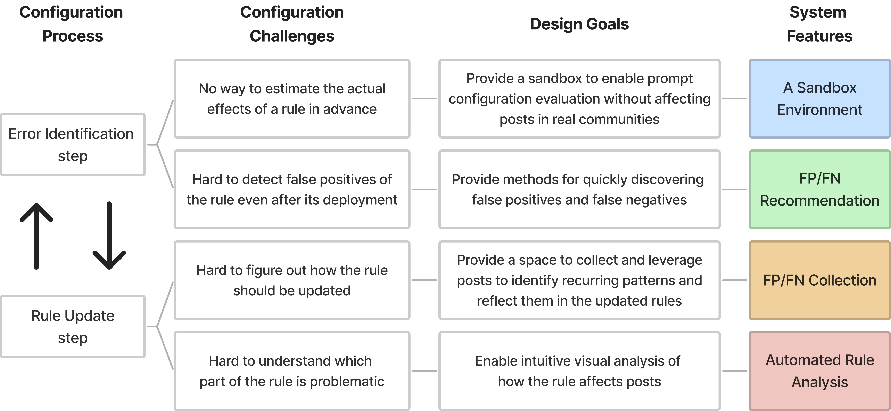
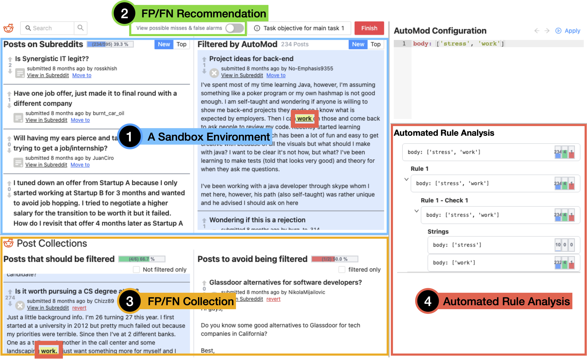
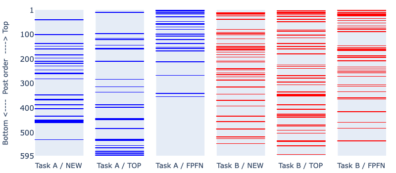
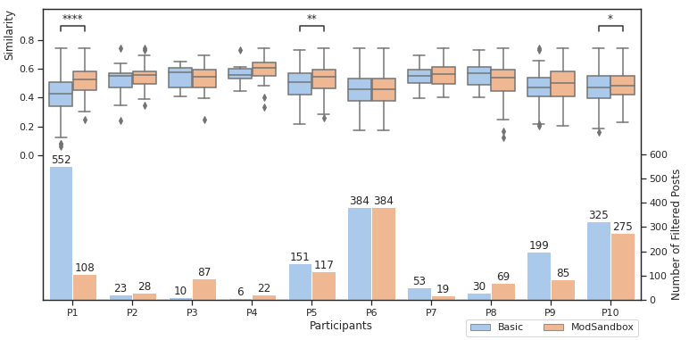

<iframe
  src='https://www.youtube.com/embed/7NGrx35mDXY'
  title='ModSandbox Presentation Video'
  referrerPolicy='strict-origin-when-cross-origin'
  allow='accelerometer; autoplay; clipboard-write; encrypted-media; gyroscope; picture-in-picture; web-share'
  allowFullScreen
  style={{ aspectRatio: '16/9', width: '100%', border: 0 }}
></iframe>

## Abstract

Despite the common use of rule-based tools for online content moderation,
human moderators still spend a lot of time monitoring them to ensure that they work as intended.
Based on surveys and interviews with Reddit moderators who use AutoModerator,
we identified the main challenges in reducing false positives and false negatives of automated rules:
not being able to estimate the actual effect of a rule in advance and having difficulty figuring out how the rules should be updated.
To address these issues, we built ModSandbox,
a novel virtual sandbox system that detects possible false positives and false negatives of a rule to be improved and visualizes which part of the rule is causing issues.
We conducted a user study with online content moderators,
finding that ModSandbox can support quickly finding possible false positives and false negatives of automated rules and guide moderators to update those to reduce future errors.

## Background

Volunteer moderators in online communities often rely on rule-based automation, such as Reddit AutoModerator, because it is transparent and configurable for local community norms. The problem is that rule changes are hard to test before deployment. A keyword rule may miss posts it was meant to catch, or it may filter benign posts and create unnecessary moderation work.

Through surveys and interviews with Reddit moderators, we identified four recurring pain points in automated-rule configuration:

1. **No preview of rule effects**: Moderators cannot easily estimate how a new or updated rule will behave on existing community posts.
2. **False positives are difficult to detect**: Wrongly filtered posts can be buried in moderation logs unless community members report them.
3. **Rule updates require pattern finding**: Moderators need to inspect false positives and false negatives, infer recurring patterns, and translate those patterns back into rule conditions.
4. **Complex rules are hard to debug**: Once a rule contains multiple checks and strings, it becomes difficult to tell which part of the configuration caused a post to be filtered.

These challenges led to two high-level goals for ModSandbox: help moderators find possible false positives and false negatives quickly, and help them configure more precise rules before those rules affect the live community.

## System Overview

ModSandbox is a virtual sandbox where moderators can import existing community posts, apply automated moderation rules, inspect likely errors, and iteratively refine their rules without affecting the actual community. The interface brings together four features that support a structured debugging workflow.

## Key Features

1. **Sandbox Environment**: Moderators import posts from their community and apply AutoModerator-style rules in a safe test space. Filtered posts are visually marked, gathered into a separate panel, and summarized with ratio bars so moderators can immediately see whether a rule is too broad or too narrow.
2. **FP/FN Recommendation**: ModSandbox surfaces likely misses and false alarms by comparing filtered and unfiltered posts against examples in the moderator's collections. This helps moderators inspect the most suspicious posts first instead of scrolling through a full moderation log.
3. **FP/FN Collection**: Moderators can collect posts that *should be filtered* and posts that should *avoid being filtered*. These collections become lightweight reference sets for identifying patterns and for judging whether a rule update is moving in the right direction.
4. **Automated Rule Analysis**: The system breaks complex configurations into rules, checks, and strings, then shows how each part affects sandbox posts and collected examples. Hover-based highlighting connects a filtered word in a post back to the rule element that triggered it, supporting both macro-level and micro-level debugging.

## Error Recommendation

The recommendation feature uses sentence embeddings to estimate semantic similarity between posts. A non-filtered post that is close to examples in "Posts that should be filtered" is treated as a possible miss. A filtered post that is far from those examples is treated as a possible false alarm. The goal is not to automate moderation decisions, but to prioritize what moderators should inspect first.

In the study task about posts asking how to get CS-relevant jobs without CS-relevant degrees, FP/FN sorting concentrated more target posts near the top of the list than chronological or popularity-based sorting. This suggests that semantic ranking can reduce the amount of browsing needed to find rule errors, although the paper also found that the benefit depended on the moderation task.

## User Study

We evaluated ModSandbox with 10 active online moderators. Participants configured AutoModerator-style rules in a basic system and then used ModSandbox to revise their configurations. The study compared how the system changed both the quality of filtered posts and the way moderators wrote rules.

For Task A, several participants produced final rules whose filtered posts were more semantically similar to the target examples after using ModSandbox. Experienced AutoModerator users also showed statistically significant improvements in similarity for some cases. Participants tended to move from simple keyword lists toward more sophisticated configurations with more rules, checks, and strings, indicating that the sandbox helped them iterate on rule scope rather than only add or remove isolated keywords.

## Design Takeaways

- **Rule testing should happen before deployment.** A sandbox gives moderators room to evaluate changes against real community history without creating live false positives or false negatives.
- **Recommendations should support inspection, not replace judgment.** ModSandbox ranks likely errors, but moderators remain responsible for deciding whether a post is actually problematic in its community context.
- **Debugging tools need both aggregate and local explanations.** Ratio bars show whether a rule is broadly over-filtering; hover links and highlighted strings show why a specific post was affected.
- **Moderation tools should respect community specificity.** Because online communities define harm and relevance differently, the system is designed around moderator-provided examples rather than a universal harmful-content classifier.
