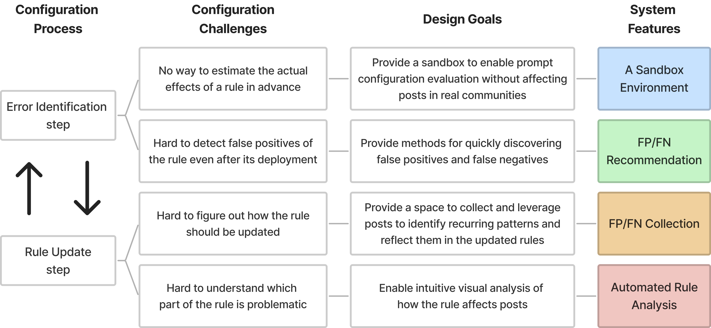

<iframe
  height='315'
  src='https://www.youtube.com/embed/7NGrx35mDXY'
  title='ModSandbox Presentation Video'
  frameborder='0'
  allow='accelerometer; autoplay; clipboard-write; encrypted-media; gyroscope; picture-in-picture'
  allowfullscreen
  className='w-full'
></iframe>

## Abstract

Despite the common use of rule-based tools for online content moderation,
human moderators still spend a lot of time monitoring them to ensure that they work as intended.
Based on surveys and interviews with Reddit moderators who use AutoModerator,
we identified the main challenges in reducing false positives and false negatives of automated rules:
not being able to estimate the actual effect of a rule in advance and having difficulty figuring out how the rules should be updated.
To address these issues, we built ModSandbox,
a novel virtual sandbox system that detects possible false positives and false negatives of a rule to be improved and visualizes which part of the rule is causing issues.
We conducted a user study with online content moderators,
finding that ModSandbox can support quickly finding possible false positives and false negatives of automated rules and guide moderators to update those to reduce future errors.

## Interview Results to Design Goals

## System Features

1. **A Sandbox Environment** helps moderators import all the posts from their community.
2. **FP/FN Recommendation** helps moderators to more quickly find possible misses (false negative) and false alarms (false positives).
3. **FP/FN Collection** helps moderators to collect interesting posts for finding their patterns for further rule updates.
4. **Automated Rule Analysis** helps analyze how the rule affected the posts in the sandbox. It shows the number of filtered posts in `Sandbox Environment'' and ``Post Collections'' (FP/FN Collection) with color bars and highlight the part of those filtered posts in their panels (red boxes in 1, 2) for macro and micro-level support of debugging each configuration.
