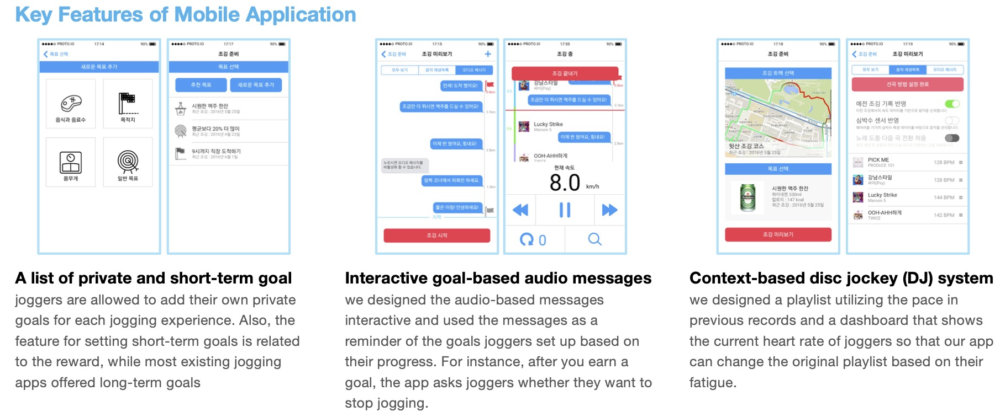

## Abstract

Regular jogging help people maintain their health.
However, it is burdensome to keep working out without clear motivation.
Although mobile applications has been developed to overcome the challenge, little is known about the guildelines for designing mobile applications that address the needs and barriers of joggers.
In this study, we identified joggers' needs and barriers and used them to produce ten principles for designing mobile applications.
We then created Mutiv, a web-based prototype of the mobile application based on the principles and evaluated the satisfaction of the joggers of the prototype.

## Poster Image

