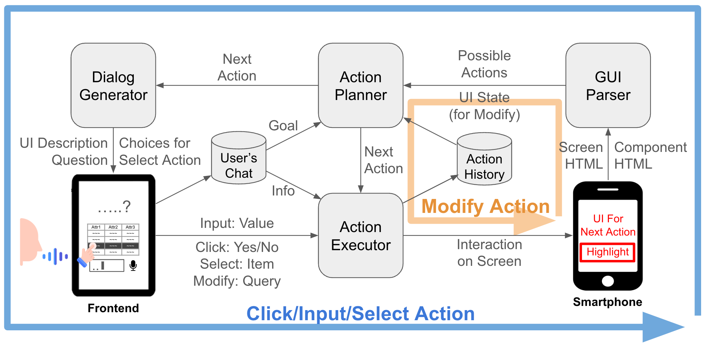
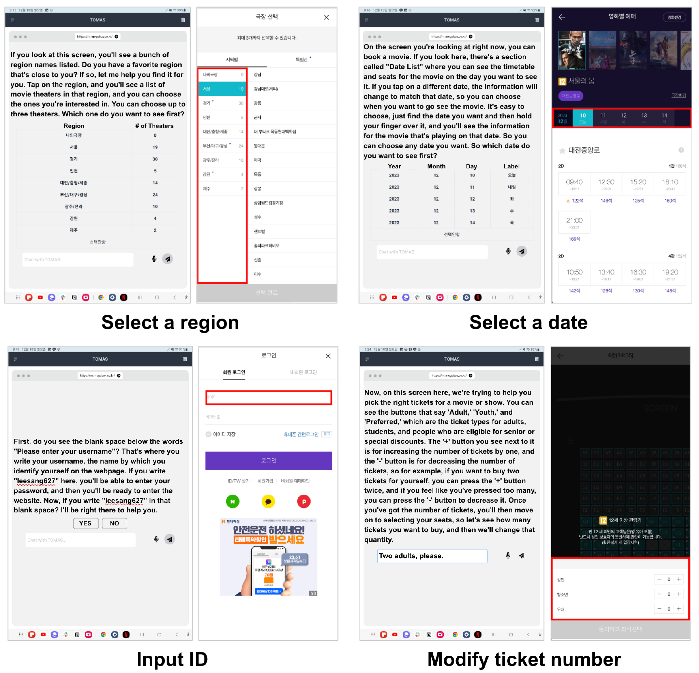

## Abstract

This research introduces the Task-Oriented Multimodal Agent System (TOMAS), which was developed to overcome the challenges older adults face in using smartphones, such as small text size, complex menu structures, and navigation issues. Interviews with students and social workers experienced in supporting elderly smartphone users helped identify key challenges, including cognitive, physical, and design difficulties, as well as two primary methods of assistance: ’Proxy Assistance’ and ’Educative Assistance.’ Inspired by educative assistance, TOMAS focuses on simplifying the user interface and integrating senior-friendly features like voice commands to empower older adults to use smartphones more independently and confidently. User testing with elderly Korean participants, conducted through a movie theater ticket booking task, revealed areas where TOMAS could be improved, particularly in response time and instruction clarity, highlighting the necessity for more intuitive and visually supportive user interfaces.

## System Pipeline

## User Interface

