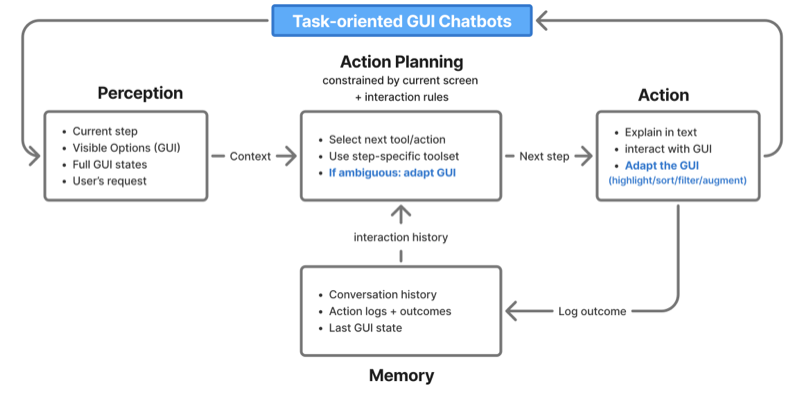
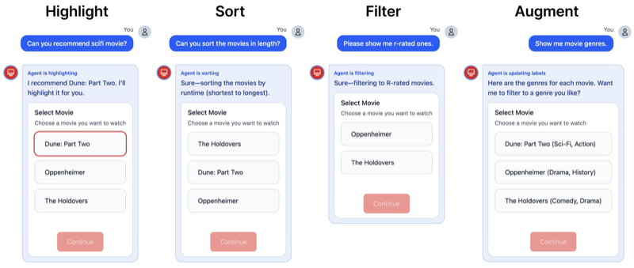

## Abstract

Task-oriented chatbots can provide graphical user interface (GUI) components, such as button groups, calendars, and seat maps, alongside conversational interaction at each step of a structured workflow to facilitate user interaction. GUIs reduce cognitive load and increase efficiency by visually presenting available options and supporting structured choices that are difficult through conversation alone. In such GUI-augmented chatbots, when users express preferences or requests in natural language, a design question arises: how should the system bridge the gap between conversational user interaction and structured GUI interaction when they are available at the same time? Current approaches either fully automate UI operations on behalf of the user, removing user agency; or generate entirely new interfaces via LLMs, discarding the carefully designed original context. In this position paper, we propose an alternative approach: an agent layer that adaptively modifies existing GUIs to support decision-making when preferences are ambiguous or subjective, rather than making selections for the user, while performing standard GUI interactions on the user's behalf when intent is clear. To demonstrate the approach, we present TUNING (Task-oriented UI Notation for Informed Nudging and Guidance), an LLM agent equipped with four lightweight GUI adaptation tools (highlight, sort, filter, and augment) that modify the visual presentation of existing UI components without requiring backend access. Through a movie ticket booking scenario, we illustrate how these adaptations provide visual cues that help users make informed decisions while maintaining their agency over the task.

